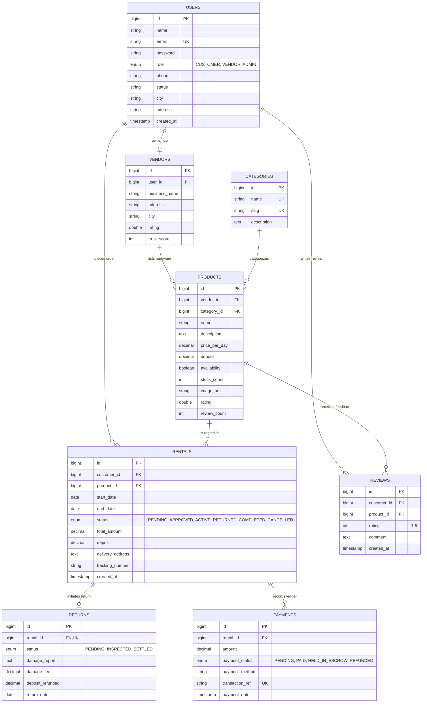

# Rentora - Database Entity Relationship (ER) Diagram & Data Dictionary

---

## Table Descriptions

| Table Name | Primary Purpose | Foreign Keys | Key Constraints |
| :--- | :--- | :--- | :--- |
| **`users`** | Core accounts for Customers, Vendors, and Admins | None | `email UNIQUE` |
| **`vendors`** | Commercial business profiles & Trust Scores | `user_id -> users(id)` | `user_id UNIQUE` |
| **`categories`** | Equipment departments & classification | None | `name UNIQUE, slug UNIQUE` |
| **`products`** | Hardware catalog items with daily rate & deposit | `vendor_id`, `category_id` | Indexed price, category, vendor |
| **`rentals`** | Booking contracts with dates, tracking, & total amount | `customer_id`, `product_id` | Indexed status, dates |
| **`returns`** | Multi-point technical inspection & deposit deductions | `rental_id -> rentals(id)` | `rental_id UNIQUE` (1:1) |
| **`payments`** | Financial transaction log & Escrow states | `rental_id -> rentals(id)` | `transaction_ref UNIQUE` |
| **`reviews`** | Verified customer feedback and 1-5 star ratings | `customer_id`, `product_id` | Rating check `1 <= rating <= 5` |
